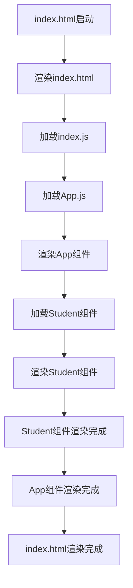

# React 基础使用demo，based on React.16.4.1

> react 官网：https://reactjs.org/
>
> 先决条件：安装nodejs，[官网](https://nodejs.org/en/)
>
> 本次教程基于环境、使用工具以及版本：
>
> - *nodejs：8.11.3*
> - *react：16.4.1*
> - *npm：6.2.0*
> - *SPA（单页应用）*

# 1.创建项目

## 1.1 安装 create-react-app

```shell
npm install -g create-react-app@2.0.0-next.3e165448
```

## 1.2 创建react项目

```shell
create-react-app react-demo
```

# 2.项目结构说明

创建好之后的项目结构


其中：

- /public/index.html是整个项目的入口文件，我们可以在该文件中添加一些CDN资源，如jQuery等。

  - index.html文件内容

    

    >P.S.：在index.html中，有一个根容器：<div id="root"></div> ，这个是整个项目的总容器，创建的组件最终都生成在该容器中。
    >
    >对于该文件，一般情况下，我们不会在这个html文件中增加我们的业务代码

  - *额外说明：在对项目进行解包后，在webpack的配置中，脚手架将src/index.js作为了整个项目的入口文件，如下图：*

    

    

- src文件夹：

  - src/index.js：跟index.html相关联，会将该js中声明的组件渲染到public/index.html中 "id=root" 的容器内

  

  >在这里，可以将 <App />认为是整个项目的根组件，要使用App组件，需要引入该组件，见L4（第四行）：通过  ***import App from './App'***  进行引用，默认情况下，webpack自动将文件作为js文件进行处理，所以这里在引入App.js的时候，不用显示指明 "./App.js"

  

# 3.JSX语法

脚手架创建的react项目中的App.js，默认使用了JSX语法

JSX语法与非JSX语法对比：


> 以上两个文件，最终编译后的效果是一样的，但右边的JSX语法提供了语法糖，可以让我们更加直观的书写代码，层次结构更为清晰。

JSX语法的一些简单说明：

1. 在JSX中，通过花括号 {} ，可以使用javascript表达式，如：

   ```JS
     render() {
       return (
         <div className="App">
            <span>hello react.</span>
            <div id="demo">
             1+1={1+1}   //最终结果:1+1=2
            </div>
         </div>
       );
     }
   ```

2. JSX中无法使用 if-else，但可以使用三元表达式来代替，如

   ```js
     render() {
       let isDisplayOne = true;
       let one="i am One";
       let two="i am Two";
       return (
         <div className="App">
            <span>hello react.</span>
            <div id="demo">
            {isDisplayOne?one:two} //通过三元表达式代替if-else，如果?号后面的内容过多，建议抽取后通过变量赋值
            </div>
         </div>
       );
     }
   ```
3. JSX中，html标签内部的注释需要用花括号括起来，如：
    ```js
    render() {
      return (
        <div className="App">
          <span>hello react.</span>
          <div id="demo">
            {/* <span>test annotation</span> */}
          </div>
        </div>
      );
    }
    ```
4. JSX中，使用数组，会将数组中的内容自动按照顺序填充到html标签中，如：
    ```js
    render() {
      let arr = [
        <span style={{color:'blue'}}>1.hello</span>,
        <span style={{color:'yellow'}}>2.world</span>
      ];
      return (
        <div className="App">
          <span>hello react.</span>
          <div id="demo">
            <div>{arr}</div>
          </div>
        </div>
      );
    }
    ```
    >如果要在jsx中使用内联属性元素，则属性值在赋值的时候需要用双花括号括起来。
5. 在JSX中，html中的一些元素属性：如class，for，需要使用 className 和 htmlFor 来做代替，如：
    ```js
    render() {
      return (
        <div className="App">
          /*以下内容最终生成的html为：<span class="testClass" for="using htmlFor">hello react.</span> */
          <span className="testClass" htmlFor="using htmlFor">hello react.</span>        
        </div>
      );
    }
    ```

# 4.Component：组件
最简单的一个组件例子：
在项目src文件夹中，创建如下目录和文件：


## 创建自定义组件：Student.js
```js
  import React from  'react' //如果要用到JSX语法，就需要导入react
  function Student(){
      return <p>大家好，我是学生A</p> //JSX
  }
  export default Student;
```
## 在App.js中使用自定义组件
```js
import React, { Component } from 'react';
import './App.css';
import Student from './Components/Student/Student'; //引入组件
class App extends Component {
  
  render() {
    return (
      <div className="App">
         <Student /> //使用组件
      </div>
    );
  }
}

export default App;
```
>1.约定：为了区分自定义组件和原生html标签，建议在导入组件命名时，使用Pascal命名法。
2.在引入自定义组件的时候，必须使用相对路径，否则会被认为是通过npm/yarn等安装的包。

在本例中，页面文件、组件的加载顺序为：


